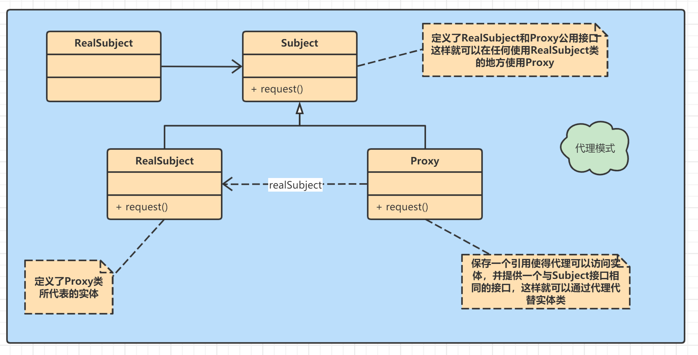

## 代理模式

为其它对象提供一个代理以控制对这个对象的访问。



**Subject类**：定义了**RrealSubject**和**Proxy**的公用接口，这样就可以在任何使用**RealSubject**的地方都可以使用**Proxy**

```java
abstract class Subject {
    public abstract void request();
}
```

**RealSubject类**：定义**Proxy**所代表的真是实体

```java
public class RealSubject extends Subject {
    @Override
    public void request() {
        System.out.println("真实的请求");
    }
}
```

**Proxy类**：保存一个引用使得代理可以访问实体，并提供与**Subject**接口相同的接口，这样代理就可以来代替实体

```java
public class Proxy extends Subject{
    RealSubject realSubject;
    @Override
    public void request() {
        if (realSubject == null) {
            realSubject = new RealSubject();
        }
        realSubject.request();
    }
}
```

**客户端代码**

```java
public class main {
    public static void main(String[] args) {
        Proxy proxy = new Proxy();
        proxy.request();
    }
}
```

