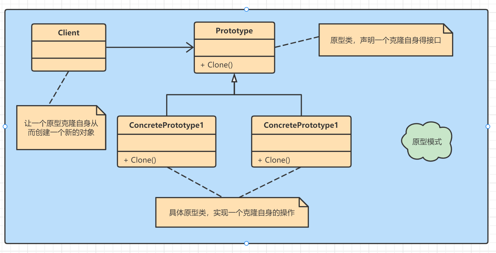

用原型实例指定创建对象的种类，并通过拷贝这些原型创建新的对象。



## 实例

**克隆羊**

实现了`Cloneable`接口中的`clone()`方法：

```java
public class Sheep implements Cloneable{
    private String name;
    private int age;
    private String color;
    
    public Sheep(String name, int age, String color) {
        this.name = name;
        this.age = age;
        this.color = color;
    }
    
    @Override
    protected Object clone() {
        Sheep sheep = null;
        try {
            sheep = (Sheep) super.clone();
        } catch (Exception e) {
            System.out.println(e.getMessage());
        }
        return sheep;
    }
}
```

**使用克隆羊**

```java
public class Client {
    public static void main(String[] args) {
        Sheep sheep = new Sheep("duoli", 18, "red");
        Sheep sheep1 = (Sheep) sheep.clone();
        sheep1.setColor("green");
        Sheep sheep2 = (Sheep) sheep.clone();
        Sheep sheep3 = (Sheep) sheep.clone();
        System.out.println("sheep: " + sheep);
        System.out.println("sheep1: " + sheep1);
        System.out.println("sheep2: " + sheep2);
        System.out.println("sheep3: " + sheep3);
    }
}
/** 输出如下
sheep: Sheep(name=duoli, age=18, color=red)
sheep1: Sheep(name=duoli, age=18, color=green)
sheep2: Sheep(name=duoli, age=18, color=red)
sheep3: Sheep(name=duoli, age=18, color=red)
*/
```

## 浅拷贝

1. 对于数据类型是基本数据类型的成员变量，浅拷贝会直接进行值传递，即将该属性值复制一份给新的对象。
2. 对于数据类型是引用类型的成员，比如：成员变量是数组、对象等，则浅拷贝会进行引用传递，也就是只是该成员变量的引用值（内存地址）复制一份给新的对象，因为实际上两个对象的该成员变量都指向同一个实例，在这种情况下，在一个对象中修改该成员变量会影响到另一个对象的该成员变量值
3. 浅拷贝就是使用的默认的`clone`

**给Sheep添加一个对象属性**

```java
public class Sheep implements Cloneable{
    private String name;
    private int age;
    private String color;
    public Sheep friend;
    
    public Sheep(String name, int age, String color) {
        this.name = name;
        this.age = age;
        this.color = color;
    }
    
    @Override
    protected Object clone() {
        Sheep sheep = null;
        try {
            sheep = (Sheep) super.clone();
        } catch (Exception e) {
            System.out.println(e.getMessage());
        }
        return sheep;
    }
}
```

**测试**：打印了sheep.friend的hashCode值，观察是否产生了新的对象

```java
public class Client {
    public static void main(String[] args) {
        Sheep sheep = new Sheep("duoli", 18, "red");
        sheep.friend = new Sheep("friend", 10, "black");
        
        Sheep sheep1 = (Sheep) sheep.clone();
        sheep1.setColor("green");
        Sheep sheep2 = (Sheep) sheep.clone();
        Sheep sheep3 = (Sheep) sheep.clone();
        System.out.println("sheep: " + sheep.friend.hashCode());
        System.out.println("sheep1: " + sheep1.friend.hashCode());
        System.out.println("sheep2: " + sheep2.friend.hashCode());
        System.out.println("sheep3: " + sheep3.friend.hashCode());
    }
}

/**
sheep: -43201939
sheep1: -43201939
sheep2: -43201939
sheep3: -43201939
*/
```


## 深拷贝

1. 复制对象的所有基本数据类型的成员变量值
2. 为所有引用数据类型的成员变量申请存储空间，并复制每个引用数据类型成员变量所引用的对象，直到改对象可达的所有对象。

深拷贝实现方式：构造方法；重写clone方法；通过对象序列化实现。

以下是拷贝对象：

```java
public class Address {
    private String city;
    private String country;
    
    public Address(String city, String country) {
        this.city = city;
        this.country = country;
    }
}

public class User {
    private String name;
    private Address address;
    
    public User(String name, Address address) {
        this.name = name;
        this.address = address;
    }
}
```

#### 构造函数

可以使用构造函数进行深拷贝，如果是基本类型或字符串则直接赋值，如果是对象则重新new一个。

```java
    @Test
    public void constructorCopy() {
        Address address = new Address("北京", "中国");
        User user = new User("小花", address);
        
        // 条用构造函数进行深拷贝
        User copyUser = new User(user.getName(), new Address(address.getCity(), address.getCountry()));
        
        // 修改源对象的值
        user.getAddress().setCity("上海");

        Assert.assertSame(user.getAddress().getCity(), copyUser.getAddress().getCity());
    }
```

#### 重载`clone()`方法

Object父类有个clone()的拷贝方法，不过它是protected类型的，我们需要重写它并修改为public类型。除此之外，子类还需要实现Cloneable接口来告诉JVM这个类是可以拷贝的。

```java
public class Address implements Cloneable {
    private String city;
    private String country;
    
    public Address(String city, String country) {
        this.city = city;
        this.country = country;
    }
    
    @Override
    public Address clone() throws CloneNotSupportedException {
        return (Address)super.clone();
    }
}

public class User implements Cloneable{
    private String name;
    private Address address;
    
    public User(String name, Address address) {
        this.name = name;
        this.address = address;
    }
    
    @Override
    public User clone() throws CloneNotSupportedException {
        // 不仅clone自身  还要clone包含对象
        User user = (User) super.clone();
        user.setAddress(this.address.clone());
        return user;
    }
}
```

需要注意的是，`super.clone()`其实是浅拷贝，所以在重写User类的`clone()`方法时，`address`对象需要调用`address.clone()`重新赋值。

```java
    @Test
    public void cloneCopy() throws CloneNotSupportedException{
        Address address = new Address("北京", "中国");
        User user = new User("小花", address);

        // 调用clone()方法进行深拷贝
        User copyUser = user.clone();

        // 修改源对象的值
        user.getAddress().setCity("上海");

        // 检查两个对象的值不同
        Assert.assertNotSame(user.getAddress().getCity(), copyUser.getAddress().getCity());
    }
```

#### 通过Apache Commons Lang序列化实现

Java提供了序列化的能力，我们可以先将源对象进行序列化，再反序列化生成拷贝对象。但是，使用序列化的前提是拷贝的类（包括其成员变量）需要实现Serializable接口。Apache Commons Lang包对Java序列化进行了封装，我们可以直接使用它。

maven添加依赖包：

```xml
<dependency>
    <groupId>org.apache.commons</groupId>
    <artifactId>commons-lang3</artifactId>
    <version>3.12.0</version>
</dependency>
```

User类、Address类实现Serializable接口：

```java
public class User implements Serializable {
    private String name;
    private Address address;
    
    public User(String name, Address address) {
        this.name = name;
        this.address = address;
    }
    
}

public class Address implements Serializable {
    private String city;
    private String country;
    
    public Address(String city, String country) {
        this.city = city;
        this.country = country;
    }
    
}
```

```java
    @Test
    public void serializableCopy() {
        Address address = new Address("北京", "中国");
        User user = new User("小花", address);

        // 使用Apache Commons Lang序列化进行深拷贝
        User copyUser = SerializationUtils.clone(user);

        // 修改源对象的值
        user.getAddress().setCity("上海");

        Assert.assertSame(user.getAddress().getCity(), copyUser.getAddress().getCity());
    }
```

#### 使用Gson

Gson可以将对象序列化成JSON，也可以将JSON反序列化成对象，所以可以用它进行深拷贝。**不需要实现Serializeble接口**。

引入Gson的依赖：

```xml
<!-- https://mvnrepository.com/artifact/com.google.code.gson/gson -->
<dependency>
    <groupId>com.google.code.gson</groupId>
    <artifactId>gson</artifactId>
    <version>2.8.8</version>
</dependency>
```

```java
    @Test
    public void gsonCopy() {
        Address address = new Address("北京", "中国");
        User user = new User("小花", address);

        // 使用Gson序列化进行深拷贝
        Gson gson = new Gson();
        User copyUser = gson.fromJson(gson.toJson(user), User.class);

        // 修改源对象的值
        user.getAddress().setCity("上海");

        Assert.assertNotSame(user.getAddress().getCity(), copyUser.getAddress().getCity());
    }
```

#### 使用Jackson

Jackson与Gson相似，可以将对象序列化成JSON，**不需要实现Serializeble接口**。明显不同的地方是拷贝的类（包括其成员变量）**需要有默认的无参构造函数**

maven依赖：

```xml
<!-- https://mvnrepository.com/artifact/com.fasterxml.jackson.core/jackson-databind -->
<dependency>
    <groupId>com.fasterxml.jackson.core</groupId>
    <artifactId>jackson-databind</artifactId>
    <version>2.13.0</version>
</dependency>
```


```java
public class User {
    private String name;
    private Address address;
    
    public User() {}
    
    public User(String name, Address address) {
        this.name = name;
        this.address = address;
    }
    
}

public class Address {
    private String city;
    private String country;
    
    public Address() {}
    
    public Address(String city, String country) {
        this.city = city;
        this.country = country;
    }
    
}
```

```java
    @Test
    public void jacksonCopy() throws JsonProcessingException {
        Address address = new Address("北京", "中国");
        User user = new User("小花", address);

        // 使用Jackson序列化进行深拷贝
        ObjectMapper objectMapper = new ObjectMapper();
        User copyUser = objectMapper.readValue(objectMapper.writeValueAsString(user), User.class);

        // 修改源对象的值
        user.getAddress().setCity("上海");

        // 检查两个对象值的不同
        Assert.assertNotSame(user.getAddress().getCity(), copyUser.getAddress().getCity());
    }
```

