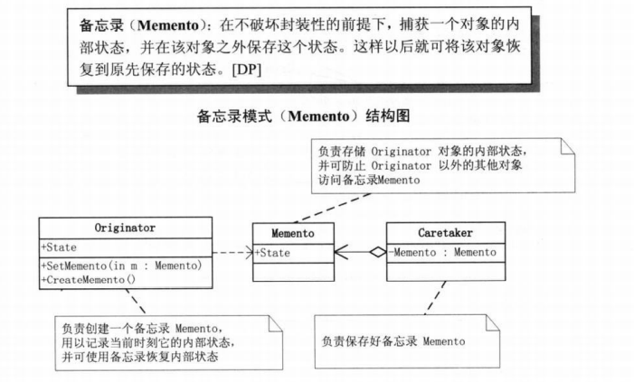

​	

**备忘录实体**

```java
public class TextWindow {
    private StringBuilder currentText;

    public TextWindow() {
        this.currentText = new StringBuilder();
    }

    public void addText(String text) {
        currentText.append(text);
    }

    public TextWindowState save() {
        return new TextWindowState(currentText.toString());
    }

    public void restore(TextWindowState save) {
        currentText = new StringBuilder(save.getText());
    }
}
```

**备忘录编辑动作类**

```java
public class TextEditor {
    private TextWindow textWindow;
    private TextWindowState savedTextWindow;

    public TextEditor(TextWindow textWindow) {
        this.textWindow = textWindow;
    }
    
    public void hitSave() {
        savedTextWindow = textWindow.save();
    }

    public void hitUndo() {
        textWindow.restore(savedTextWindow);
    }
}
```

**备忘录状态类**

```java
public class TextWindowState {
    private String text;

    public TextWindowState(String text) {
        this.text = text;
    }

    public String getText() {
        return text;
    }
}
```

**测试类**

```java
@Test
public void testMemento() {
    TextEditor textEditor = new TextEditor(new TextWindow());
    textEditor.getTextWindow().addText("The Memento Design Pattern\n");
    textEditor.getTextWindow().addText("How to implement it in Java?\n");
    textEditor.hitSave();

    textEditor.getTextWindow().addText("Buy milk and eggs before coming home\n");
    System.out.println(textEditor.getTextWindow().getCurrentText());

    textEditor.hitUndo();

    System.out.println(textEditor.getTextWindow().getCurrentText());
}
/** s
The Memento Design Pattern
How to implement it in Java?
Buy milk and eggs before coming home

The Memento Design Pattern
How to implement it in Java?
*/
```

