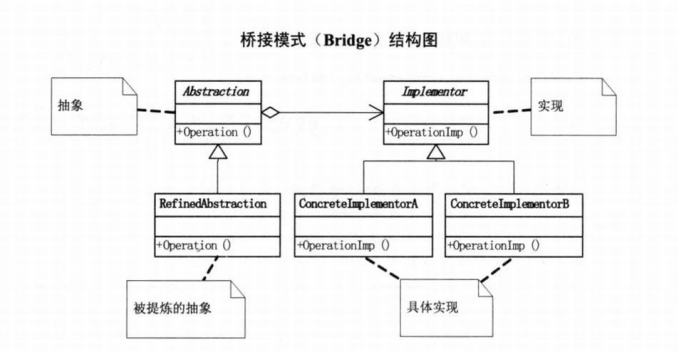

**抽象类**

```java
public abstract class Shape {
    protected Color color;

    //standard constructors

    abstract public String draw();
}
```

**接口**

```java
public interface Color {
    String fill();
}
```

**实现接口的类**

```java
public class Blue implements Color{
    @Override
    public String fill() {
        return "color is  Blue";
    }
}
```

**继承抽象类**

```java
public class Square extends Shape {
    public Square(Color color) {
        super(color);
    }

    @Override
    public String draw() {
        return "Square drawn. " + color.fill();
    }
}
```

**测试类**

```java
public void testBridge() {
    //a square with red color
    Shape square = new Square(new Blue());

    System.out.println(square.draw());
}
// Square drawn. color is  Blue
```

