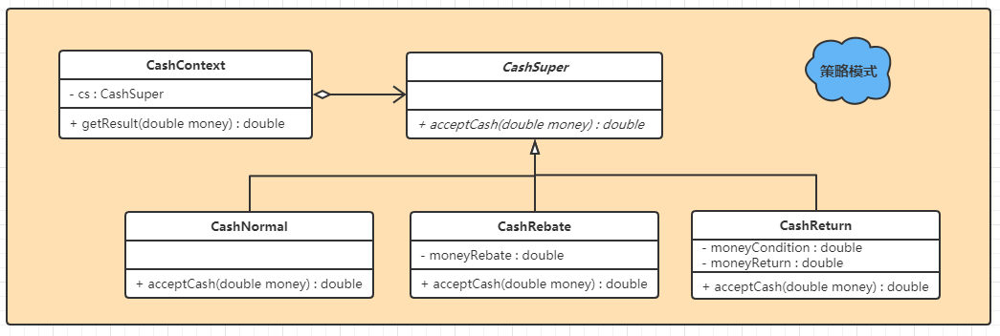

## 1. 策略模式

策略模式是一种定义一系列算法的方法。所有这些算法完成的都是相同的工作，只是实现不同，它可以以相同的方式调用所有的算法，减少了各种算法类与使用算法类之间的耦合。

策列模式的`Strategy(CashSuper)`类层次为`Context(CashContext)`定义了一系列可以重用的算法。继承有助于抽离这些算法中的公共功能。

## 2. 实例

实现一个商场收银系统，UML类图如下：



**CashContext类**

```java
public class CashContext {
    private final CashSuper cs;		// 声明一个CashSuper对象
    
    public CashContext(CashSuper cashSuper) {	// 通过构造方法传入具体的收费策略
        this.cs = cashSuper;
    }
    
    public double getResult(double money) {		// 根据不同的收费策略计算结果
        return cs.acceptCash(money);
    }
}
```


**CashSuper抽象类**

```java
public abstract class CashSuper {
    public abstract double acceptCash(double money);	// 定义一个抽象方法：收费策略
}
```


**CashNormal策略**

```java
public class CashNormal extends CashSuper{
    
    @Override
    public double acceptCash(double money) {	// 实现抽象方法：为一种收费策略
        return money;
    }
}
```


**CashRebate策略**

```java
public class CashRebate extends CashSuper{
    
    private final double moneyRebate;
    
    public CashRebate(double moneyRebate) {
        this.moneyRebate = moneyRebate;
    }

    @Override
    public double acceptCash(double money) {	// 实现抽象方法：为一种收费策略
        return money * moneyRebate;
    }
}
```


**CashReturn策略**

```java
public class CashReturn extends CashSuper{
    
    private final double moneyCondition;
    private final double moneyReturn;
    
    public CashReturn(double moneyCondition, double moneyReturn) {
        this.moneyCondition = moneyCondition;
        this.moneyReturn = moneyReturn;
    }
    
    @Override
    public double acceptCash(double money) {		// 实现抽象方法：为一种收费策略
        double result = money;
        if (money >= moneyCondition) {
            result = money - Math.floor(money / moneyCondition) * moneyReturn;
        }
        return result;
    }
}
```


**客户端代码**

这里客户端需要去判断使用哪一个策略？~~代码中没有体现~~

```java
public class CashTest {
    public static void main(String[] args) {
        CashContext cc1 = new CashContext(new CashNormal());
        CashContext cc2 = new CashContext(new CashRebate(0.8));
        CashContext cc3 = new CashContext(new CashReturn(300, 100));

        System.out.println(cc1.getResult(300));
        System.out.println(cc2.getResult(300));
        System.out.println(cc3.getResult(300));
    }
}
```


**策略与简单工厂结合**

为解决上述问题，在**CashContext类**中使用简单工厂模式：

```java
public class CashContext {
    private CashSuper cs = null;
    
    public CashContext(String type) {
        switch (type) {
            case "normal":
                this.cs = new CashNormal();
                break;
            case "return":
                this.cs = new CashReturn(300, 100);
                break;
            case "rebate":
                this.cs = new CashRebate(0.8);
                break;
        }
    }
    
    public double getResult(double money) {
        return cs.acceptCash(money);
    }
}
```

然后再调用时就可以只使用`CashContext`类，做到客户端和计费策略彻底分离。

```java
public class CashTest {
    public static void main(String[] args) {
        CashContext cc1 = new CashContext("normal");
        CashContext cc2 = new CashContext("return");
        CashContext cc3 = new CashContext("rebate");

        System.out.println(cc1.getResult(300));
        System.out.println(cc2.getResult(300));
        System.out.println(cc3.getResult(300));
    }
}
```