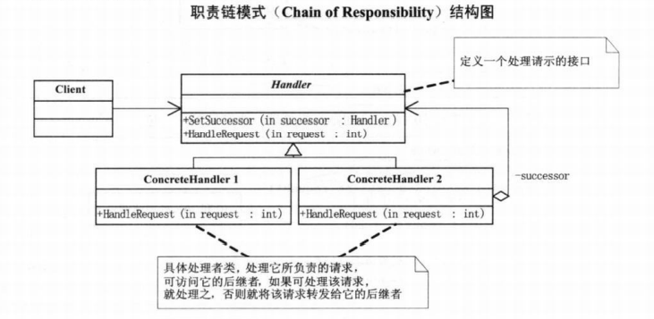

**抽象类**

```java
public abstract class Handler {
    protected Handler successor;

    public void setSuccessor(Handler handler) {
        this.successor = handler;
    }
    
    public abstract void handleRequest(int request);
}
```

**处理者类**

```java
public class ConcreteHandler1 extends Handler{
    
    @Override
    public void handleRequest(int request) {
        if (request > 0 && request < 10) {
            System.out.println("0~10 处理请求");
        } else if (successor != null) {
            super.successor.handleRequest(request);
        }
    }
}

public class ConcreteHandler2 extends Handler {

    @Override
    public void handleRequest(int request) {
        if (request >= 10 && request < 20) {
            System.out.println("10~20 处理请求");
        } else if (successor != null) {
            super.successor.handleRequest(request);
        }
    }
}

public class ConcreteHandler3 extends Handler {
    
    @Override
    public void handleRequest(int request) {
        if (request >= 20 && request < 30) {
            System.out.println("20~30 处理请求");
        } else if (successor != null) {
            super.successor.handleRequest(request);
        }
    }
}
```

**测试类**

```java
@Test
public void testResposibility() {
    Handler handler1 = new ConcreteHandler1();
    Handler handler2 = new ConcreteHandler2();
    Handler handler3 = new ConcreteHandler3();
    handler1.setSuccessor(handler2);
    handler2.setSuccessor(handler3);

    int[] arr = new int[]{2, 12, 22, 32};

    for (int a : arr) {
        handler1.handleRequest(a);
    }
}
/**
0~10 处理请求
10~20 处理请求
20~30 处理请求

```

